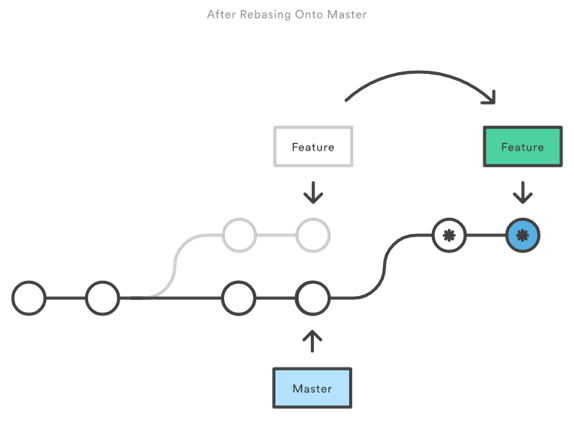

## Rebase & History Modification
Ever wanted to travel back in time? If not, go watch `Back to the Future`, then
come back. If you do, then this is your chance!

Git Rebase is a powerful tool that allows you to modify history, allowing to fix
mistakes and even better, have a clean versioning control ssystem.

### How does it work?
The idea behind rebasing is simple; you just edit the order in which commits
apply over each other - with a few other quirks along the way.

This way, you can achieve some amazing results. A common example of this is when
you're working on a branch and the base branch gets updated. You now have a
merge conflict and have to update your branch with the base, creating a new
commit to apply the merge. But that's not quite clean, and we don't want any
more `Merge with develop` commits in our control system. After all, **✨ Pretty 
VCS = Happy Team 💁🏻‍♂️**.

So, you can just rebase! By altering the order in which commits apply over each
other, you can make it _appear_ so that your branch came _after_ all the changes
in the base branch, and you can fix any conflicts that arise along the way.
Boom!

Visually, all of this would simply look like the following:

### How to?
So, ok, I bet you're now convinced that rebasing is quite amazing. But, how do
you _actually_ do it? There are actually several ways. 

For starters, you can simply use `git rebase BASE_BRANCH_NAME` while standing on
the branch that needs to be rebased and everything will be done automatically
for you. Should any conflicts appear, just fix them (**pro-tip:** just use [git
mergetool](Mergetool.md)!) and use `git rebase --continue` to keep on with the
rebase. Several aliases are available for all these operations, you can check
them out in the [.zsh_aliases](../../.zsh/.zsh_aliases) file.

Another way in which you can use git rebase is interactively. Why? Well,
remember when I told you that rebasing had its quirks? Here they come!

By rebasing interactively, we'll have much more control of what exactly we are
doing, and can actually order the commits however we please. We can delete them,
making it as though they never existed, squash them together, rename them...
You really get to do just about whatever you'd like. So, let's get to how to do
this.

Whenever you want to rebase interactively, just add the `-i` flag at the end of
the command. Simple, right? Afterwards, a text file will open up in your editor
of choice (I recommend using VIM, you can find tips and tricks on this editor
over [here](VIM.md)), listing all commits that will be rebased. They'll be
applied from top to bottom, but you can always alter this order by moving the
lines around. But that's not all.

You'll notice that each line starts with the `pick` keyword. That means the
commit will be applied normally. However, you might want to replace the keyword
with another one for some commits in order to achieve different results. Below
is a small list of some of them, just to get you started.

- `reword` picks the commit but allowing you to alter its message.
- `edit` will use the commit, but upon applying it will halt the rebase to allow
  for ammending.
- `squash` will use the commit, melding into the previous one (that is, the one
  just on top of it)
- `fixup` will work just like squash, but discarding the commit message. This is
  the one you'll be using most if you follow the 
  [Pull Request Best Practices](../../BestPractices/PullRequests.md) guidelines.

One thing to keep in mind is that, if you just want to alter the history of your
current branch, and not rebase it with the base, you can always use `HEAD~k` as
the rebase branch, `k` being the number of commits backwards you'd like to
alter. Just play with it a few times and you'll get what I mean.

### Not everything is for free
Remember all those Time-Travel movies where the actual action of Time-Travelling
brought up some serious consequences? Time Paradoxes and stuff, Universe
implosions, the regular. Well, we don't have that here. But, if you mess with
time, there'll always be consequences.

In our case, it's that you'll be obliged to force push any changes you make with
rebase. This might not be an issue to you, but it may be the case that other
teammate is working on the same branch as you are, and force pushing your
changes _will_ break theirs. So, just keep it in mind and be careful with it. As
a good rule of thumb, if you're sure you're the only one working on that branch,
you're good to go (you heard me, there's no force-pushing on the master
branch!).
